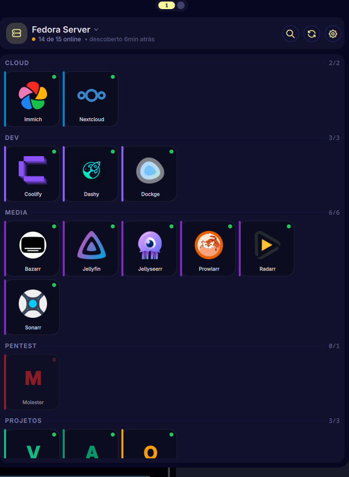

# Server Dashboard

> **Stream Deck-style dashboard for [Noctalia Shell](https://github.com/noctalia-dev/noctalia-shell)** — auto-discovers your self-hosted services over SSH+Docker, multi-server with Tailscale import, click-to-open in browser, live health checks.

A homelab control center living in your bar. Built as a custom plugin for Noctalia. Replaces [Dashy](https://dashy.to/) / [Homarr](https://homarr.dev/) / [Homepage](https://gethomepage.dev/) without leaving the shell.



---

## ✨ Features

- **🔍 Auto-discovery via SSH+Docker** — runs `docker ps` on the remote host and renders each container as a tile (only those with HTTP-reachable ports)
- **🌐 Multi-server with switcher** — manage as many homelab boxes as you want; switch in the panel header with one click
- **📡 Tailscale import** — pulls online Tailscale peers and lets you add them in one click
- **🔑 Auto-detect SSH user** — tries `root`, `ubuntu`, `debian`, `fedora`, `ec2-user`, `admin`, `opc`, `centos`, `arch`, plus your default — picks the first that works
- **🖼️ Real service logos** — 30+ logos from [homarr-labs/dashboard-icons](https://github.com/homarr-labs/dashboard-icons), with fallback to a colored letter tile
- **💚 Live health status** — parallel `curl` health check every 30s, color-coded dot per tile (green/red/gray)
- **🏷️ Smart categorization** — services auto-grouped (Media, Cloud, Dev, Pentest, Projetos, Infra, Home) via regex rules
- **🎨 Overrides** — rename, recolor, recategorize, hide, or pin custom icon per container — by raw container name
- **🪛 Manual mode** — for servers without SSH (or just for monitoring URLs you don't own): hardcode a list of services per server
- **💾 Smart caching** — discovery cached per server, panel opens instantly even when SSH is slow

---

## 📷 What it looks like

The header shows the active server with chevron-down for switching (when more than one server). Below: categorized tiles with real brand logos, live status dots, brand-color accent on the left edge. Clicking a tile opens the service URL in your default browser.

States covered:
- ✅ **OK** — tiles light up, last-discovery timestamp ticks
- ⏳ **Loading** — busy indicator centered while SSH+docker runs
- ❌ **Error** — friendly message ("SSH key not configured — run `ssh-copy-id ...`") with retry button

---

## 📦 Installation

### As a Noctalia custom plugin source

Add this repo to `~/.config/noctalia/plugins.json` under `sources`:

```json
{
  "sources": [
    { "enabled": true, "name": "Noctalia Plugins", "url": "https://github.com/noctalia-dev/noctalia-plugins" },
    { "enabled": true, "name": "Server Dashboard", "url": "https://github.com/<your-user>/noctalia-server-dashboard" }
  ],
  "states": {
    "server-dashboard": { "enabled": true }
  }
}
```

Restart Noctalia (`pkill -f "qs -c noctalia-shell"; qs -c noctalia-shell &`). The plugin downloads automatically.

### Manual install (recommended for hacking)

```bash
git clone https://github.com/<your-user>/noctalia-server-dashboard.git \
  ~/.config/noctalia/plugins/server-dashboard

# Add to plugins.json
jq '.states["server-dashboard"] = {"enabled": true}' \
  ~/.config/noctalia/plugins.json > /tmp/p.json && mv /tmp/p.json ~/.config/noctalia/plugins.json
```

Then add the bar widget via Settings → Bar → add `plugin:server-dashboard`.

### Requirements

- Noctalia Shell ≥ 4.0
- `curl`, `ssh`, `docker` — `docker` only on the remote host
- Optional: `tailscale` on the client (only for the import feature)

---

## ⚙️ Configuration

All settings live in `~/.config/noctalia/plugins/server-dashboard/settings.json`. The plugin Settings UI handles the common cases (servers, intervals, etc); for advanced stuff (overrides, category rules, icon map) edit the JSON directly.

### Adding a server

Three ways:

1. **Settings → Servers → "+ Importar do Tailscale"** — lists online peers; "+ Adicionar (auto)" detects the SSH user automatically
2. **Settings → Servers → "+ Adicionar manual"** — fill in host/user/port
3. **Edit `settings.json`** directly with Noctalia stopped (the plugin overwrites the file on save)

### Server config shape

```json
{
  "servers": [
    {
      "id": "fedora-server",
      "name": "Fedora Server",
      "host": "100.118.33.37",
      "user": "th",
      "port": 22
    },
    {
      "id": "vps-1",
      "name": "Some VPS (no SSH access)",
      "host": "1.2.3.4",
      "manualServices": [
        { "name": "My App", "url": "http://1.2.3.4:3000", "category": "Projetos", "color": "#F2D4D7", "icon": "M" }
      ]
    }
  ],
  "activeServerId": "fedora-server"
}
```

If a server has `manualServices`, SSH+docker is skipped and the predefined list is used (great for boxes you don't have shell on).

### Overriding a discovered container

Containers are matched by their **raw name** from `docker ps`. Override per-container:

```json
"overrides": {
  "my-app-container-1": {
    "name": "My App",                 // pretty display name
    "category": "Projetos",           // override category
    "color": "#F59E0B",               // brand color (hex)
    "icon": "M",                      // letter fallback (when no iconFile)
    "iconFile": "icons/custom.png",   // override logo path
    "protocol": "https",              // force https
    "hidden": true                    // hide from the panel entirely
  }
}
```

### Category rules

Auto-categorization runs regex against the container name:

```json
"categoryRules": [
  { "match": "jellyfin|sonarr|radarr", "category": "Media" },
  { "match": "nextcloud|immich",       "category": "Cloud" }
]
```

First match wins. Unmatched containers fall into "Outros".

### Icon map

Maps service slugs to logo files:

```json
"iconMap": {
  "jellyfin": "icons/jellyfin.png",
  "my-thing": "icons/my-thing.png"
}
```

Drop any PNG/SVG in the `icons/` folder and reference it. Partial matching: if the container name *contains* the slug (e.g. `immich_server` contains `immich`), the icon is used.

---

## 🎛️ IPC

The plugin exposes itself via Quickshell IPC:

```bash
# Force a discovery cycle on the active server
qs -c noctalia-shell ipc call plugin:server-dashboard discover

# Health check (curl) all known services
qs -c noctalia-shell ipc call plugin:server-dashboard refresh

# Switch to another configured server
qs -c noctalia-shell ipc call plugin:server-dashboard switchServer my-vps

# Open a service in the browser by name
qs -c noctalia-shell ipc call plugin:server-dashboard open Jellyfin

# List Tailscale peers (populates internal state, visible in Settings UI)
qs -c noctalia-shell ipc call plugin:server-dashboard listTailscale

# Manually trigger SSH user auto-detection for a server
qs -c noctalia-shell ipc call plugin:server-dashboard autoDetect my-vps

# Edit SSH user of a server (clears its discovery cache, re-runs discovery)
qs -c noctalia-shell ipc call plugin:server-dashboard editServerUser my-vps root

# Remove a server
qs -c noctalia-shell ipc call plugin:server-dashboard removeServer my-vps

# JSON status (active server, counts, errors, timestamps)
qs -c noctalia-shell ipc call plugin:server-dashboard status

# Open the panel
qs -c noctalia-shell ipc call plugin:server-dashboard togglePanel
```

---

## 🧠 How discovery works

```
panel open / 5min timer / IPC discover
                  ↓
       active server has manualServices?
              ↙              ↘
            yes               no
             ↓                 ↓
       use that list    ssh -o ConnectTimeout=3 -BatchMode=yes
                              user@host 'docker ps --format ...'
                                       ↓
                              exit code 0?
                              ↙           ↘
                           yes             no
                            ↓               ↓
                  parse {Name|Ports|Image}   err contains "user doesn't exist"
                            ↓                or "Permission denied"?
                  filter: port on 0.0.0.0/    ↓
                  Tailscale IP, NOT 127.x      yes (first attempt)
                            ↓                   ↓
                  apply overrides[name]    auto-detect SSH user in parallel
                            ↓               (10 candidates, picks first that works)
                  cache + render               ↓
                            ↓               editServer({user: detected})
                  parallel curl on each       ↓
                  URL (xargs -P 8, 3s         retry discovery
                  timeout) → status dots
```

A second failure (after auto-recovery) shows the error in the panel with retry button. The recovery flag clears once discovery succeeds, so future failures can re-attempt.

---

## 🎨 Tile colors

Built-in category colors (override via `categoryColors` in settings.json):

| Category | Color |
|---|---|
| Media | `#7B2CBF` |
| Cloud | `#0082C9` |
| Dev | `#8B5CF6` |
| Home | `#2BB67D` |
| Pentest | `#DC2626` |
| Projetos | `#F59E0B` |
| Infra | `#64748B` |
| Outros | `#94A3B8` |

Per-container `color` in `overrides` always wins.

---

## 🐞 Troubleshooting

**Panel says "Servidor inalcançável"** — Tailscale isn't connected, or the host's IP changed. Check `tailscale status`.

**"SSH negado" or "Nenhum usuário SSH funcionou"** — your SSH key isn't on the remote host. Run `ssh-copy-id <user>@<host>` once. Auto-detection will then pick it up.

**"Docker não encontrado no servidor"** — install Docker on the remote, or ensure the SSH user is in the `docker` group (so it can run `docker ps` without sudo).

**Service shows as "down" but I can open it manually** — by default the plugin treats any HTTP response (200, 302, 401, 403) as up. If your service returns 5xx, it'll show down. Adjust the curl logic in `Main.qml` if needed.

**Plugin save wipes my `manualServices`** — known limitation: stop Noctalia (`pkill -f noctalia-shell`) before editing `settings.json` manually. The plugin's `saveSettings()` doesn't know about custom fields and overwrites them. Or use the upcoming `manualServices` editor in the Settings UI (PRs welcome).

---

## 🙏 Credits

- **[Noctalia Shell](https://github.com/noctalia-dev/noctalia-shell)** — the Wayland desktop shell this plugin lives in
- **[homarr-labs/dashboard-icons](https://github.com/homarr-labs/dashboard-icons)** — the gorgeous service logos
- **[Quickshell](https://quickshell.org/)** — the QML engine powering Noctalia

---

## 📄 License

MIT — see [LICENSE](LICENSE)
